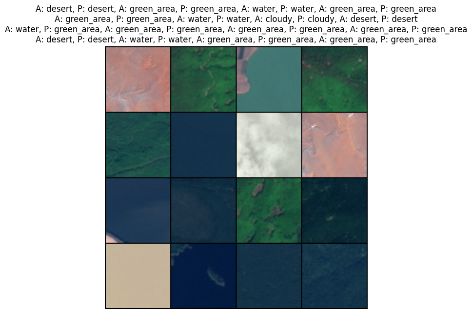

# Satellite_Image_Classification_Project

> About

- Satellite image classification model built using PyTorch.
- Achieved 96.8% accuracy in predicting 4 different types of terrain after 102 epochs.

> Example

> Additional Info

- Dataset can be found here: [Kaggle](https://www.kaggle.com/datasets/mahmoudreda55/satellite-image-classification)
- Best model weights can be found at file `satellite_image_classification_model_best.pth`.
